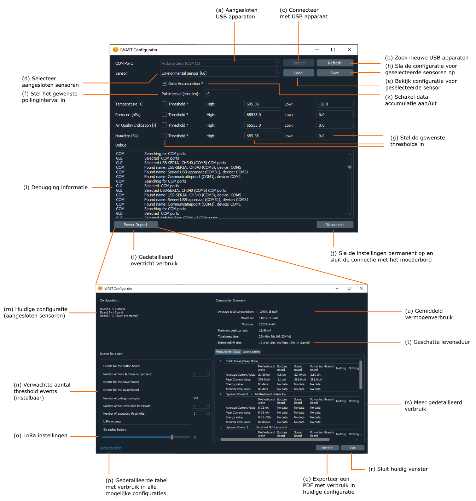

De configuratie-tool kan je downloaden via XXX. Wanneer je het .exe-bestand opent, installeert de tool vanzelf op je computer.

Hieronder zie je een screenshot van de configuratie-tool. Voer de aangeduide stappen in volgorde uit ((a) tot (j)).

Sluit het moederbord, samen met de sensoren die je wilt configureren via USB aan je computer aan. 
De aangesloten USB apparaten zie je rechtsboven (a).
Vernieuw indien nodig het lijstje van USB apparaten door op 'refresh' te drukken (b).
Selecteer het USB apparaat naar keuze (je moederbord) en druk op connect (c).

Daarna moeten de sensoren die aan je moederbord geconnecteerd zijn in het lijstje (d) verschijnen. 
Selecteer de sensor die je wilt configureren. 
Klik vervolgens op 'load' om de huidige configuratie (instellingen) van de sensor te bekijken (e).

Pas de instellingen aan indien nodig. 
Bepaal ten eerste of je wilt werken via polling- of interrupt-gebaseerde communicatie, of of  je beide wilt combineren.
Meer info over polling vind je [hier] (what-is-polling.html) en over interrupt-gebaseerde communicatie [hier] (what-are-thresholds).

Als je de data van je sensor NIET periodisch wilt opvragen (GEEN polling), laat het polling interval dan op 0 staan.
Als je de data van je sensor WEL periodisch wilt opvragen (WEL polling), stel het polling interval dan in op het gewenste aantal minuten.
We raden aan het polling interval in te stellen op minimum 1 minuut.

Als je de data van je sensor via interrupt-gebaseerde communicatie wilt opvragen, betekent dit dat ALLE sensordata doorgestuurd wordt wanneer een bepaalde drempelwaarde overschreden wordt.
Zo kan je bijvoorbeeld alle gegevens (temperatuur, luchtdruk, luchtvochtigheid en algemene luchtkwaliteit) van de luchtkwaliteitsensor opvragen van zodra de temperatuur hoger wordt dan 25 &deg;C.
Om dit te bereiken moet je bij 'Temperature &deg;C' threshold aanvinken, `TH` instellen op 25 en `TL` op een waarde hoger dan 25 (g).

Bij sensoren die meerdere fysische grootheden meten, bv de luchtkwaliteitsensor, kan je voor meerdere fysische grootheden drempelwaarden instellen.
Merk op dat alle sensorgegevens worden doorgestuurd wanneer 1 drempelwaarde overschreden wordt. 
Stel dat je een drempel ingesteld hebt voor de temperatuur (doorsturen als temperatuur > 25 &deg;C) en luchtdruk (doorsturen als druk > 1060 hPa).
Als nu de drempelwaarde voor de temperatuur overschreden wordt, maar die voor druk niet, (of omgekeerd), dan worden toch alle gegevens (temperatuur, luchtdruk, luchtvochtigheid en algemene luchtkwaliteit) doorgestuurd.

Als je tevreden bent over de instellingen voor je sensor, sla je de configuratie op (h). 
Je krijgt wat info te zien in het vakje onderaan (i), maar daar hoef je je normaal gezien niets van aan te trekken.
Nu moet je alleen nog op de knop 'disconnect' onderaan drukken om alle instellingen permanent op te slaan (j).
Nu mag je de USB connectie met het moederbord loskoppelen.

