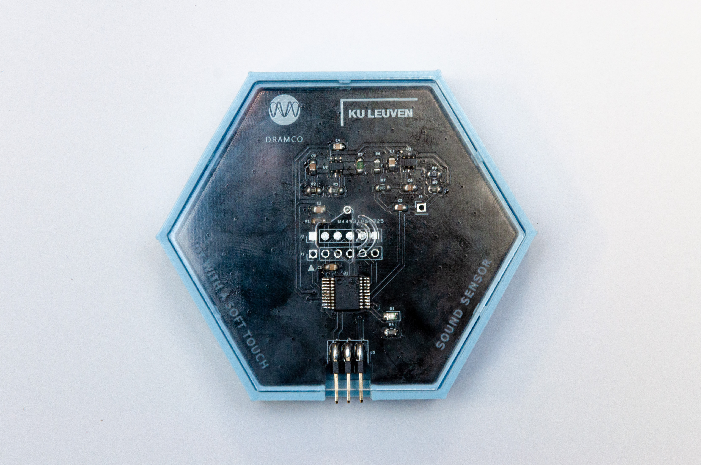

# Sound Sensor

This sensor measures the sound level.
You can measure it at fixed time intervals and/or transmit the value when
the level falls below or rises above a threshold. More information regarding thresholds see [this](../Configuration/what-are-thresholds.html).

Pay attention! Due to the limited data streams it is not possible to stream sound. The sensor sends the sound level at regular intervals, or when a preset threshold value has been exceeded.

Pay attention! Due to the manner in which sound levels are calculated, the measured sound level is always at least 70 dB. 
Therefore it does not make sense to try to measure 'quiet' sounds.
It is also not allowed to set thresholds lower than 75 dB, as this will lead to constant data transmission, which consume a lot of power and will drain the battery.

## Applications:
- Monitoring sound levels and/or noise polution
	* e.g., monitoring noise at the playground
	* e.g., is a local party too loud?
- Activity detection:
	* e.g., is someone present in a classroom?

## Technical Information
The sound sensor contains a number of components:

### Microphone
A Vesper VM1010 is chosen because it is a low power microphone with a good performance. The microphone consumes 87 µA in active mode (measured). There is also a mode-pin to enable sleep-mode which reduces the current to approximately 5µA. To enable the sleep mode, one has to supply a low level voltage to the mode pin and vice versa. The sensitivity of the microphone equals -38 dBV while the frequency response curve is flat for the audible frequencies.

### High pass filter
The passive high pass filter has a -3dB-frequency of 100 Hz and removes the DC-offset of 0.8 V supplied by the microphone. Only 1 alternation of the sound wave is taken into account. This reduces the component cost and increases the stability of the circuit.

### Amplifier
An non-inverting amplifier is dimensioned to amplify the signal with 30 dB. A TLV341 is used as operational amplifier because it’s gain bandwidth product of 2.3 MHz is rather high. The quiescent current measures approximately 70 µA per channel.

### Low pass filter
A Sallen-Key low pass filter is dimensioned with a -3dB-frequency of 8 kHz to reduce the amplitude of the unwanted ultrasonic sounds. An amplification of 2.73 dB amplifies the signal to an amplitude which is appropriate for the ADC.

### Analog-to-digital converter
The 12 bit ADC of the PIC16F18446 samples the analog signal to 16-bit values with a sample frequency of 20 kHz. Because only 1 alternation is used, the ADC will measure the amplitude and not the peak-to-peak value. The PIC16F18446 will sample 1000 values to make sure the max value is approximated as close as possible to the real signal originating from the analog circuit. Whenever a threshold-value is exceeded, an interrupt will inform the motherboard that a dB value is ready.

### Communication
The microphone module communicates with the motherboard via I2C-commands to set the threshold value or timing interval.
