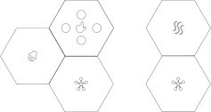

# IoT With a Soft Touch

Dit project wordt ontwikkeld door de onderzoeksgroep DRAMCO van de KU Leuven Technologiecampus Gent, thuisbasis van de opleiding Industrieel Ingenieur. Doel van dit project is aan te tonen hoe divers “Internet of Things” (IoT) toepassingen zijn en de koudwatervrees bij niet-specialisten weg te nemen. Wij maken een ‘plug-and-play’ IoT-rugzak, waarmee iedereen eenvoudig aan de slag kan om een IoT-toepassing te bouwen. De technische moeilijkheden hebben wij voor je weggenomen; zodat jij al je aandacht kan richten op het probleem dat je wil aanpakken. Wij geven dan ook geen kant-en-klare problemen en/of oplossingen mee: de bedoeling is dat je zelf een probleem bedenkt, al dan niet uit je dagelijkse leven, en dat je creatief aan de slag gaat met onze IoT-rugzak om dit probleem op te lossen. Wel geven we enkele voorbeeldtoepassingen mee zodat je een goed beeld krijgt van de mogelijkheden van deze IoT-rugzak.
De naam “IoT with a soft touch” heeft een dubbele betekenis. Enerzijds slaat dit op het wegnemen van barrières voor leerlingen en personen met een niet hard-wetenschappelijke achtergrond. Anderzijds wijst dit op de toepassingsdomeinen van IoT, die ook buiten de state-of-the-art technologische settings, bv. in de zorgsector, gezocht kunnen worden.
Deze bundel bevat een inleiding over het internet der dingen en beschrijft het “IoT with a soft touch”-systeem zodat leerlingen met voldoende achtergrond het project kunnen aanvatten.

## Internet-of-Things

### What is IoT?
Het aantal geconnecteerde apparaten is de laatste 50 jaar exponentieel gegroeid. Zo een geconnecteerd apparaat bestaat uit elektronica die gegevens verzamelt, verwerkt en uitwisselt met andere geconnecteerde apparaten. Die gegevens kunnen heel divers zijn, zoals temperatuur, locatie, spraak, foto’s of video, enz.
Begin 2000 introduceerde een wetenschapper aan de bekende Amerikaanse universiteit MIT de term ‘het internet der dingen’, in het Engels Internet of Things of (de term die we vanaf nu zullen gebruiken) kortweg IoT. Hiermee doelde hij op een toekomst waarin alle fysische voorwerpen in de wereld geconnecteerd zouden zijn in één groot netwerk. De ambitie van IoT is een ‘slimme wereld’ te maken. Door een grote hoeveelheid ‘domme’ apparaten te connecteren kan een veelheid aan toepassingen met moderne technieken aangepakt worden. Zo kennen we nu al slimme thermostaten, geconnecteerd aan het internet, die weten wanneer jij niet thuis bent. In die situatie zal het stoppen het huis te verwarmen met het doel energie te besparen. Ook sporthorloges, die je hartslag, snelheid en trapfrequentie meten tijdens het fietsen, kunnen je fitheid en vermoeidheid monitoren. Deze toepassingen hebben als doel de levenskwaliteit van de gebruiker te verbeteren.

### IoT Applicaitons
Naast bestaande toepassingen, kan IoT nog op veel andere vlakken ingezet worden. We sommen enkele voorbeelden op:

#### (1)	‘Slimme gezondheidszorg’
Op dit moment is onze gezondheidszorg reactief. Dat betekent dat een patiënt eerst ziek wordt, alvorens hij de dokter bezoekt, een diagnose krijgt en een behandeling voorgeschreven krijgt. IoT maakt het mogelijk continu hartslag, bloeddruk, insuline niveaus, lichaamstemperatuur, en complexere parameters zoals stapsnelheid en gedrag te meten. De combinatie van al deze gegevens en hun continue opvolging laat toe sluimerende gezondheidsproblemen te signaleren nog voor de patiënt er last van ondervindt. 
Een voorbeeld: sensoren in het huis van een oudere man zouden kunnen opmerken dat de man zich niet meer zo vlot kan verplaatsen. Het IoT systeem zou dan de dokter van die man kunnen contacteren en dit probleem signaleren waarop de dokter de man een gepaste behandeling kan aanraden, bv. een heupprothese of kinesitherapie. In het oude systeem, zonder IoT, zou de dokter de man pas zien als er al iets gebeurd is, bv. als de man last krijgt van zijn heup of erger als de man zijn heup gebroken is door een val.
De gezondheidszorg zou dus kunnen getransformeerd worden van reactief (reageren als er klachten zijn of er iets gebeurd is) naar proactief (op basis van sensorgegevens ingrijpen alvorens de gevolgen te groot zijn).

#### (2)	‘Slimme landbouw’
Sensoren die samenwerken kunnen helpen de landbouw te optimaliseren. Bij het telen van groenten en andere gewassen kunnen gegevens over vochtigheid, lichtinval, temperatuur en weersvoorspellingen gecombineerd worden om de irrigatie van planten optimaal te regelen. Ook in de veeteelt zouden voorspellingen kunnen gedaan worden over zieke koeien of varkens, o.b.v. bv. geluidsopnames. Zieke dieren kunnen dan opgespoord en geïsoleerd worden zodat ze de rest van de kudde niet besmetten.

#### (3)	‘Slim transport’
Het fileprobleem zou serieus verminderd kunnen worden als auto’s zouden kunnen communiceren met elkaar en met slimme verkeersborden. Het verkeer zou zo veel nauwkeuriger voorspeld kunnen worden, waarop gps’en zich kunnen baseren voor de optimale route naar je bestemming. Jij zou bv. kunnen verwittigd worden wanneer je moet vertrekken om tijdig op je bestemming aan te komen en je bestemmeling (bv. je partner thuis) kan op de hoogte gebracht worden wanneer jij thuis zal zijn. Communicatie tussen auto’s kan ongevallen vermijden, of de overheid op de hoogte brengen van slechte of gladde wegen.

#### (4)	‘Slimme elektriciteitsnetten’
Het is moeilijk grote hoeveelheden elektrische energie op te slaan. Daarom is het belangrijk de productie en het verbruik van elektriciteit op elkaar af stemmen. Zeker bij hernieuwbare energie, gebaseerd op energiebronnen zoals wind en zon die soms wel en soms niet beschikbaar zijn, is dit geen evident probleem. Het internet der dingen zou kunnen toelaten het verbruik van elektriciteit af te stemmen op de beschikbaarheid van elektriciteit uit dergelijke onvoorspelbare energiebronnen. Zo kan een ‘slimme’ wasmachine, die verbonden is met het internet der dingen, beslissen enkel te wassen wanneer er teveel elektriciteit geproduceerd wordt door hernieuwbare energiebronnen.

#### (5)	‘Slimme huizen’
Dit is de meest gekende toepassing van het internet der dingen. Denk maar aan koelkasten die kunnen detecteren dat de boter bijna op is en dit toevoegen aan je boodschappenlijstje en dit doorsturen naar de lokale Colruyt. Zo krijg jij bij je wekelijkse Colruyt-afhaling meteen alle boodschappen die je nodig hebt automatisch mee naar huis. Of denk aan een ‘slimme’ living, waarbij de lichten automatisch gedimd worden en de thermostaat stopt andere kamers te verwarmen wanneer jij een film start op de smart-tv.

### IoT systemen
IoT is een visie waarbij apparaten geïnterconnecteerd worden. Daar zijn we uiteraard nog lang niet, maar vele mensen denken al na over de vereisten en de mogelijkheden van dergelijke systemen. Op kleinere schaal worden nu al IoT systemen in gebruik genomen. Maar hoe ziet zo’n systeem er nu precies uit?
Onderdelen van een IoT systeem
Een IoT-systeem bestaat uit vier grote onderdelen: (1) sensoren die de omgeving scannen, (2) een centrale verwerkingseenheid die de signalen van de sensoren omzet in bruikbare data, (3) een connectie tussen de slimme apparaten en de cloud, en (4) de cloud zelf.

#### Sensoren
Een sensor zou je kunnen definiëren als een apparaat(je) dat een stimulus ontvangt en omzet in een elektrisch signaal. Een stimulus is de hoeveelheid, eigenschap of toestand die vertaalt wordt naar een elektrisch signaal. Voorbeelden van stimuli zijn: lichtinval, versnelling, geluid, afstand, temperatuur, chemische samenstelling, … Het resulterend elektrisch signaal is bijvoorbeeld een elektrische spanning of een elektrische stroom.
Vaak gebruikte sensoren in IoT toepassingen zijn camera’s, microfoons, temperatuursensoren en accelerometers. Een accelerometer kan de versnelling in x-, y- en z-richting meten. Maar er bestaan nog veel andere sensoren, bv. om je hartslag of stressniveau, om de grootte van een magnetisch veld of om de chemische samenstelling van een gas te meten.
Centrale verwerkingseenheid
Het doel van de centrale verwerkingseenheid is het omzetten van de signalen uit de sensoren (analoog domein) naar data die verwerkt kan worden door computers (digitaal domein). Simpel gezegd bestaat een analoog signaal uit continue meetwaarden die onbeperkte waarden kunnen aannemen. Een digitaal signaal bestaat uit discrete meetwaarden die op bepaalde tijdstippen gemeten worden en die slechts bepaalde waarden (bv. maar niet noodzakelijk gehele getallen) kunnen aannemen. Hier zullen echter beperkte berekeningen op uitgevoerd worden, door hun gelimiteerd computationeel vermogen. Het doel van deze hardware is voornamelijk het vertalen en verpakken van data uit het analoge domein naar het digitale domein die dan verder verwerkt kan worden in de cloud. 
(Draadloze) connectie
Apparaten moeten informatie uitwisselen en combineren om werkelijk tot ‘slimme’ IoT toepassingen te leiden. Het uitwisselen van deze data gebeurt over een netwerk naar ‘de cloud’ voor verder verwerking.
Neem als voorbeeld terug de ‘slimme’ thermostaat die je huis opwarmt tegen de tijd waarop jij thuiskomt. Een thermostaat op zich is niet ‘slim’ genoeg om dit te verwezenlijken. Er kan echter gebruik gemaakt worden van andere sensoren zoals de GPS in de smartphone en/of smartwatch van de bewoner. Doordat deze sensoren met elkaar geconnecteerd zijn kan de thermostaat op voorhand het huis verwarmen en komt de bewoner toe in een warm huis.

#### De cloud
De cloud staat voor een netwerk van computers die aanzienlijke data-opslag en rekenkracht ter beschikking stellen aan gebruikers.
In ons geval worden de gegevens van de sensoren in een IoT systeem gedeeld en opgeslagen in de cloud. Wat kan je nu met die gegevens doen?

- In monitoring toepassingen kan een gebruiker via een website die gegevens opvragen en die verder verwerken. Dit kan op zich al voldoende zijn om de probleemstelling aan te pakken. Denk hierbij bijvoorbeeld aan een stem-toepassing in de klas. Leerlingengroepen kunnen na discussie via drukknoppen stemmen of ze al dan niet akkoord gaan met een stelling. Die gegevens worden draadloos doorgestuurd naar de cloud en de leerkracht kan via een website nagaan hoeveel leerlingen akkoord zijn met de gegeven stelling.
- In event-based toepassingen zal een applicatie geactiveerd worden in bepaalde gevallen, denk bv. het automatisch verwittigen van de hulpdiensten indien de IoT sensoren indiceren dat een oudere man een ernstige val gemaakt heeft van de trap.
- In nog meer geavanceerde toepassingen is er terugkoppeling voorzien: denk bijvoorbeeld aan een ‘no school’-alarm dat afgaat van zodra een temperatuurdrempel in een klaslokaal overschreden wordt tijdens de hittegolf.

### Uitdagingen in IoT
In het bovenstaande beschreven we dat IoT een interessant en snel veranderend domein is met een oneindig aantal toepassingen. Maar natuurlijk zijn er ook een aantal uitdagingen. Ten eerste: dataverkeer: het doorsturen van sensorgegevens leidt tot een enorme toename aan draadloos dataverkeer. Ten tweede: energieverbruik: sensoren moeten gedurende lange tijd op een kleine batterij kunnen functioneren.

#### Data-overdracht
Om de toekomstvisie van een slimme wereld mogelijk te maken, moeten sensoren continu een grote stroom aan informatie verwerken. Om even aan te tonen om hoeveel informatie het gaat: een camera die een hele dag filmt, resulteert in 2.4TB data per dag. Zelfs een microfoon die continu spraak opneemt produceert elke dag 2GB aan data.
Wie veel Youtube kijkt of ooit een groot bestand probeerde te downloaden weet dat dergelijke grootteordes van gegevensoverdracht tijd vragen. Beeld je nu in dat in de ideale IoT-wereld in elk huis, bedrijf, auto, … honderden van die sensoren constant data naar de cloud doorsturen. Het spreekt voor zich dat dit quasi onmogelijk is.
We moeten dus manieren vinden om de datastromen te beperken. Slimme wetenschappers aan universiteiten onderzoeken momenteel hoe we sensoren slimmer kunnen maken, zodat ze minder informatie continu moeten doorsturen. Eén van de pistes die daarbij onderzocht wordt, is ‘machine learning’: we leren apparaten, machines, … aan om zelf op een ‘slimme’ manier te beslissen welke gegevens belangrijk genoeg zijn om door te sturen.

Dat gaat te ver voor dit project. Binnen dit project gebruiken we twee manieren om de datastromen te beperken.
1.       De eerste manier is door slechts op periodieke intervallen gegevens door te sturen. Zo kunnen we instellen dat een temperatuursensor in een klaslokaal slechts om de 30 sensoren de gedetecteerde temperatuur moet doorsturen.
2.       De tweede manier is door enkel relevante gegevens door te sturen. Zo kunnen we bv. zeggen dat een geluidsniveaumeter die gebruikt wordt om geluidsoverlast te monitoren, enkel het geluidsniveau moet doorsturen als een bepaalde geluidsniveau drempel overschreden wordt.

#### Vermogenverbruik
De droom is dat IoT toepassingen in de achtergrond verdwijnen en veel handige functies in ons leven (denk maar aan de ‘slimme koelkast’) quasi onopgemerkt uitvoeren. Om dit doel werkelijk te bereiken moeten de sensoren autonoom (zelfstandig) opereren met minimaal menselijk ingrijpen. Dit houdt o.a. in dat de sensoren en de draadloze communicatie slechts heel weinig vermogen mogen verbruiken, zodat een gebruiker niet gedwongen wordt om de twee dagen de batterijen van alle ‘slimme apparaten’ in huis te vervangen.
Het vermogenverbruik van een IoT systeem hangt o.a. af van de draadloze communicatietechniek en van de hoeveelheid data die doorgestuurd moet worden.

## The IWAST System
Het “IoT with a soft touch”-systeem bestaat uit
(1)    Een gateway/toegangspoort. Naar de gateway worden de sensorgegevens draadloos doorgestuurd.
(2)    10 moederborden, die een batterij en de elektronica die nodig is voor de draadloze communicatie bevatten, waarop telkens sensoren kunnen aangesloten worden
(3)    Sensoren, ook wel dochterborden genoemd. Het overzicht van de sensoren, hun aantallen en mogelijke toepassingen staat in de tabel hieronder.
De moederborden maken een draadloze connectie met de gateway. De gegevens van de sensoren, aangesloten op elk moederbord, worden naar de gateway doorgestuurd. De gateway is verbonden met de server, waar de sensorgegevens opgeslaan worden. De data is toegankelijk via een website, zowel via de computer, als via de smartphone.

### Draadloze communicatietechniek
In de uitgewerkte bundel komt een gedetailleerde uitleg over draadloze communicatie.
Zoals hierboven aangehaald heeft de draadloze communicatietechniek een invloed op het energieverbruik van de moederborden. Zoals in elk ontwerpprobleem moet ook bij de keuze van de draadloze communicatietechnologie een evenwicht gezocht worden tussen verschillende vereisten. “There is no such thing as free lunch”: je kan niet alles krijgen in het leven wat je zou willen. Binnen dit project werd gekozen voor de communicatietechnologie LoRa (Long Range). 
We lijsten hieronder de voor- en nadelen van LoRa-communicatie op:
+ energiezuinig: de draadloze communicatie kost niet veel energie, waardoor de sensormodules lang op eenzelfde batterij kunnen functioneren zonder dat de batterij moet vervangen worden. Bij optimale condities zou een batterijduur langer dan jaar geen uitzondering zijn.
+ groot draadloos bereik: de sensoren kunnen tot op grote afstand gegevens naar de gateway doorsturen. In sommige gevallen tot wel 40 km ver! In praktische omstandigheden kan je berichten sturen tot wel enkele kilometers ver.
- Beperkte hoeveelheid data die kan doorgestuurd worden binnen een vast tijdsinterval. Daardoor is het niet mogelijk geluid of video continu door te sturen. Afhankelijk van het aantal en type sensoren kunnen sensormodules ongeveer om de 5 minuten de sensorwaarden doorsturen.

## Belangrijke informatie voor leerkrachten

- Er worden momenteel twee tools ontwikkeld, die zowel in het Engels als het Nederlands beschikbaar zullen zijn.
	* Configuratie-tool: De configuratie-tool wordt eenmalig gebruikt om de sensoren te configureren nadat ze aan het moederbord aangesloten zijn.
		- Configuratie van de sensoren houdt in dat bepaalde parameters ingesteld worden
			* Bv. voor geluidsniveau-sensor: drempelwaarde voor geluidsoverlast
			* Bv. voor temperatuur-sensor: interval waarop meetwaarden moeten doorgestuurd worden.
		- De parameters per sensor worden op een intuïtieve manier weergegeven in de configuratie-tool. We voorzien een documentatie over de betekenis van de parameters indien nodig.
		- De configuratie-tool wordt lokaal op een computer geïnstalleerd.
		- Minimum versie besturingssysteem voor configuratie-tool: windows 7
		- De computer hoeft niet permanent internetconnectie te hebben, maar haalt wel updates op online. Bij eventuele updates is het niet noodzakelijk de configuratie-tool manueel te updaten of opnieuw te installeren.
		- We gaan na of admin-rechten nodig zijn om de configuratie-tool op de schoolcomputers te installeren. Indien dit admin-rechten nodig zijn, maar de IT-dienst dit niet toelaat, zullen de leerlingen/leerkracht zelf een laptop moeten voorzien.
	* Web-interface: de web-interface is toegankelijk via een internet browser en laat toe de sensorgegevens weer te geven in een tabel en indien gewenst ook in een grafiek.
		- De sensorgegevens of een selectie daarvan kunnen ook gedownload worden in csv-formaat voor verdere verwerking, bv. in Python als programmeeroefening of in excel.
	* In de rugzak wordt een gateway voorzien. Gebruik van de gateway is enkel nodig als de school niet binnen de dekking van The Things Network valt. The Things Network is een open source netwerk voor IoT toepassingen gebaseerd op LoRa. 
	* Als leerlingen een probleemstelling buiten de scope van het huidige project willen onderzoeken of behandelen, kunnen we op ad-hoc basis onderzoeken of het mogelijk en opportuun is hier verder zaken voor te ontwikkelen. Dan ontmoeten wij de leerlingen graag om hun motivatie te peilen en de kwaliteit van hun project in te schatten.

